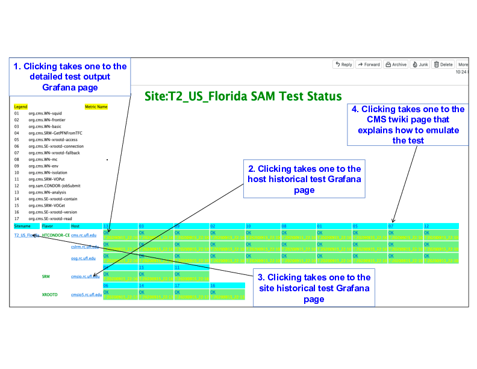

# ftl_check_sam3_sitemon

Minimally large effort Emulation of CMS SAM Dashboard in plain cgi/HTML or for failed test alert

The following dashboard can be viewed via a web server (See section [3]) or an email agent, e.g., Thunderbird (See section [4]).

[1] How to configure the script?

In the script, ftl_check_sam3_sitemon.sh and cms_sam3_sitemon_dashboard_cron_email.sh, change:

1 inputs

2 notifytowhom

3 tld

4 port

notifytowhom is the crypted email address (Check the pattern).

tld and port are for the web server cgi script.

token.txt is empty in this repo. 

Without the token inside token.txt, the script will fail.

You need to obtain a token to do search https://monit-grafana.cern.ch/api/datasources/proxy/${DBID}/_msearch

from the CMS Monitoring team, Christian or somebody.

[2] How to be alerted for failed tests?

The following is an example crontab entry

15 * * * * /opt/cms/services/ftl_check_sam3_sitemon.sh > /opt/cms/services/ftl_check_sam3_sitemon.log 2>&1

[3] How to put it on a web server?

cp ftl_check_sam3_sitemon.sh to the web server /cgi-bin/

Point the browser to http://${web_server_hostname}:${port}/cgi-bin/ftl_check_sam3_sitemon.sh to see the old style SAM test dashboard emulation

In the browser display, there are mainly 3 types of clickables:

1 Sitename: When the sitename is clicked, it shows the SAM test history in the Grafana dashboard for the site and when the dashboard is further clicked, one can see the 15 min test history. From there, one can control the duration of the history time line and so forth

2 Hostname: When the host name is clicked, it shows the SAM test history in the Grafana dashboard for each host

3 LEGEND Number : When the clickable legend number is clicked, one can see how to emulate each SAM test.

[4] How to send the dashboard to your browser-capable email client, e.g., Thunderbird

cronize cms_sam3_sitemon_dashboard_cron_email.sh like so:

15 * * * * /opt/cms/services/cms_sam3_sitemon_dashboard_cron_email.sh T2_US_MIT > /opt/cms/services/cms_sam3_sitemon_dashboard_cron_email.log 2>&1

It will deliver the dashboard to your Thunderbird inbox with all clickables mentioned in section [3].
